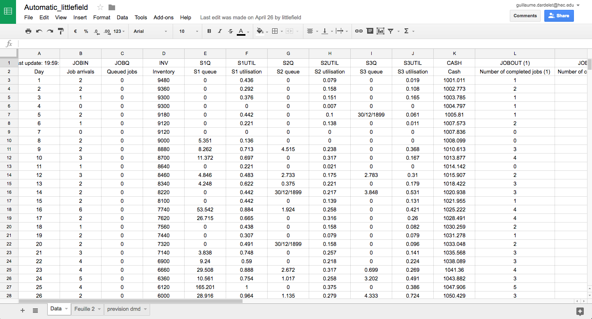
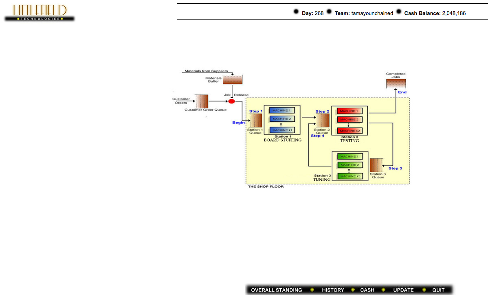

# EasyLittleField

## What it is

I created EasyLittleField for a Supply Chain business game at HEC Paris on Spring 2016.
It is a web app that helps you visualize the state of the game more quickly, and take better decision.
Instead of having to go to through the web interface, all your results and relevant information are in a Google SpreadSheet, updated automatically.

I used python for the script, and Google App Engine for the hosting and CRON task. 

## How to use it

Teams can register at http://littlefield-1285.appspot.com/ by providing their team name, password and an URL to a blank Google Sheet.
The python CRON task will then automatically poll the game's server every 30 minutes to get the latest values of all 20 parameters of the game.

## Screenshots

